## File Structure

There are 2 floders and 13 branches

### Folders

* **CustomKeyboard:** a keil project based on CH552
* **KeyBoardSetter/KeyboardSetter:** a Qt project using hid_api as library to communicate with CH552 chip hardware.

### branches

* **main:** newest developping version with HID log and new UI (testing...).
* **Version 3.0:** new UI.
* **FinalVersion 2.1:** most "stable" version. (ゝω・´★)

## Download

Click the given link below will automatically redirect to a URL and download a zip file for you，it's **NECESSARY** to  download this software for keyboard configuration. the downloaded zip file is built from branch FinalVerison2.1

 **[Click Here To Download Software](http://8.210.3.182:9999/man/ZDDKeyboardSetter.zip)**

## After Downloading

1. After downloading zipped file (by clicking the link above),unzip it somewhere.

   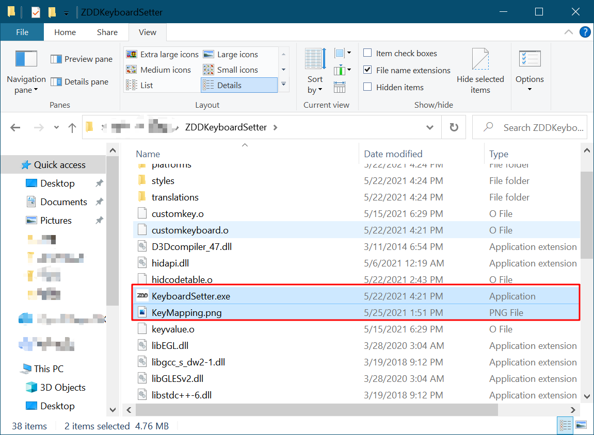

2. Change directory to the folder and find 2 specific files named "KeyboardSetter.exe" and "KeyMapping.png".

   * "KeyboardSetter.exe" is a software used for configuring your Keyboard

   * "KeyMapping.png" is a picture that reference the relation between your hardware switch and its related button in software setter(KeyboardSetter.exe) .

     ​	**For example**:  If you bought a 2-key keyboard, your device can be found in "KeyMapping.png" as the image showed below 👇

     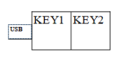

     * The tiny rectangle 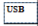 references the Micro USB wire which you plug into your device.

     * The larger rectangle 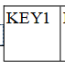 references the switch on your device.

     * And the "KEY1" on the switch means **in the software**, the switch in related position will be represented by button "KEY1".

       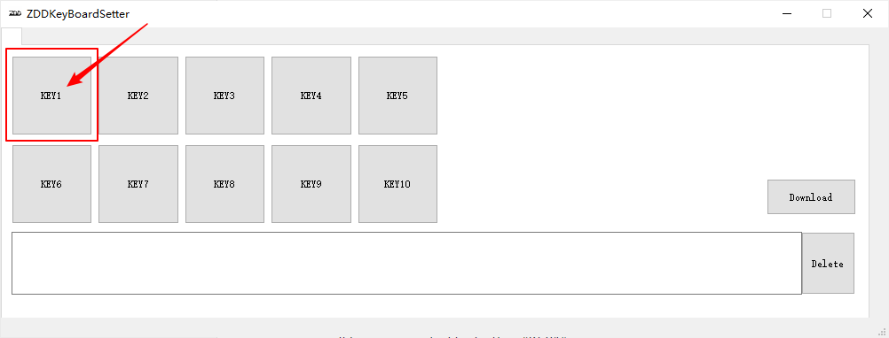

     

## HOW   TO  USE

1. Plug your device into your computer. When it plugged in, the LED on device will be turned on.

   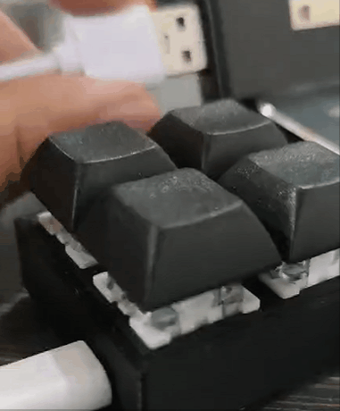

2. Double click "KeyboardSetter.exe" 

3. According to KeyMapping.png ,find the represented button you want to configure,then click it,it will turn red after clicking, that also means you are now editing this switch. And the soft-keyboard will display. 

   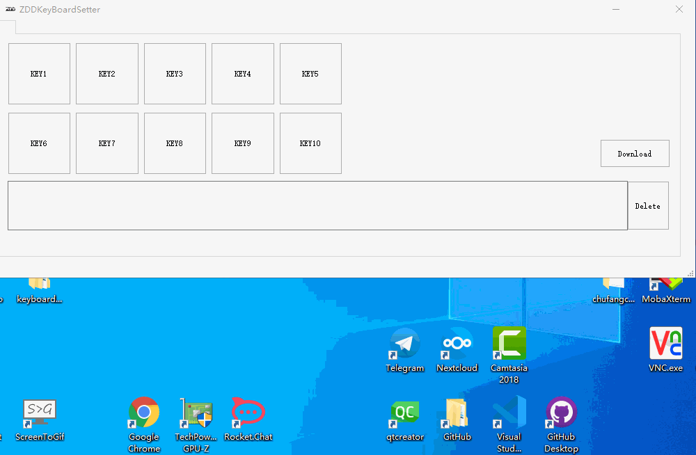

4. Press some keys on your soft-keyboard to set the behave  of the switch 

   * For example: The below gif shows how you can set **"Ctrl + C"** (hotkey known as "Copy")  to **"KEY1"**

     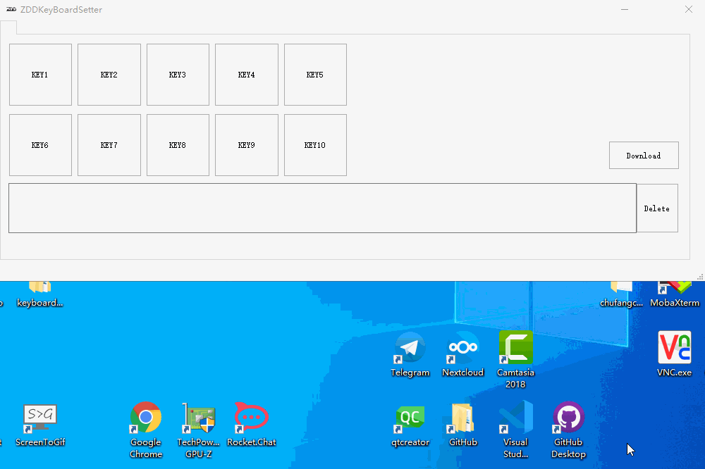

     After pressing "C" ,the program will auto-complete setting and the action of the switch named "KEY1" will be set to "Ctrl + C"

5. Finally you need to apply settings or configurations to your device ,you need to download them to device by clicking the download button  **with your device plugged in**.

   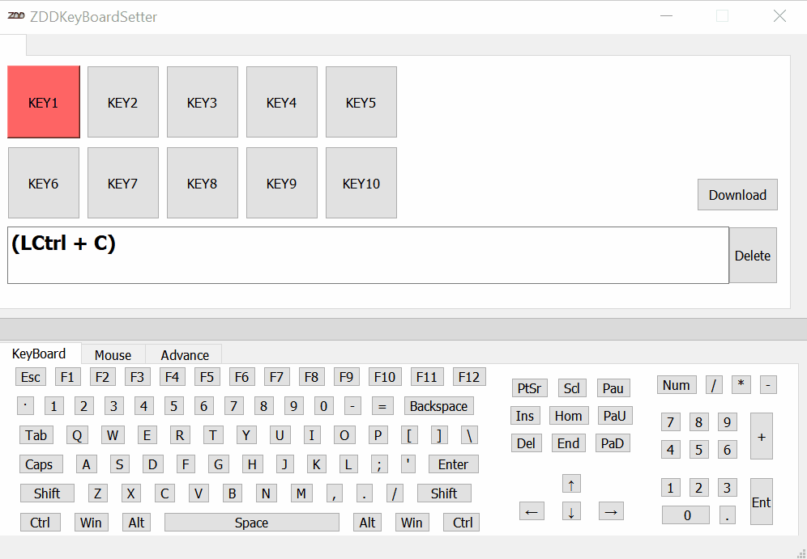

6. After download ,the action of the switch will change instantly.

## Advance Feature

Our production also has some advance features such as **Macro** (continuously send key to computer), **Multi-media control** (eg. paly/pause music), **Mouse clicking simulation**... 

### Macro

A **Macro** is an array of keys sending to computer sequentially. (eg. password,command,hotkeys.) With **Macro**, you can achieve some certain purpose by click one switch on the keyboard. 

* The gif below offers an example of setting up "Open terminal" to a certain switch.

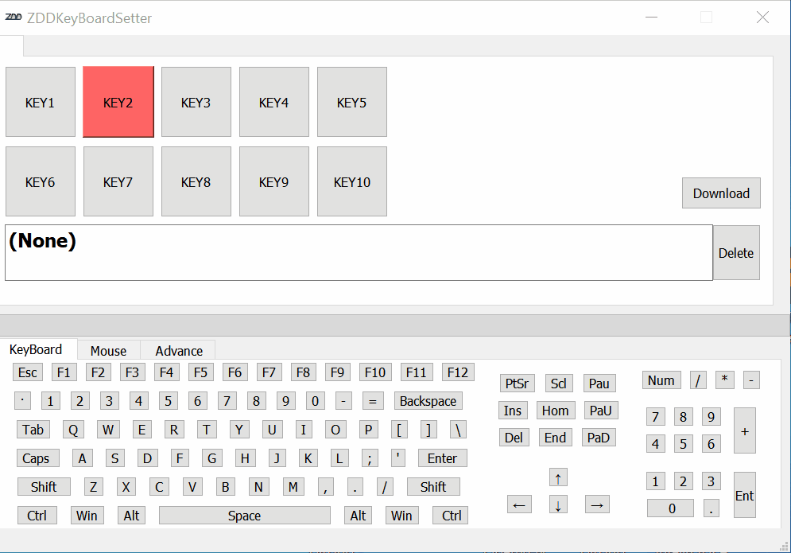

* (Win+R) :  Run window will pop up
* (Delay 0.6s + C) : Wait for Run window pop up and type "c"
* (M) : Type "m"
* (D) :  Type "d"
* (Enter) : Type "enter"

The final result is showed below:

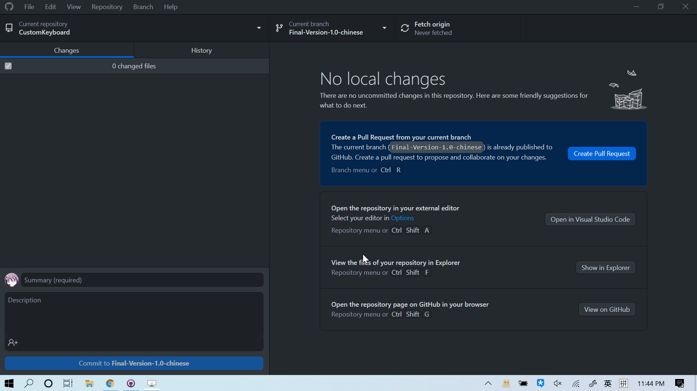

When you press "KEY3" , a command window will instantly show up,It acts like a bad USB!

* You can also set **One-key Password** on a certain switch.

Assume your password is "Ha*q123", you can do setup like below:

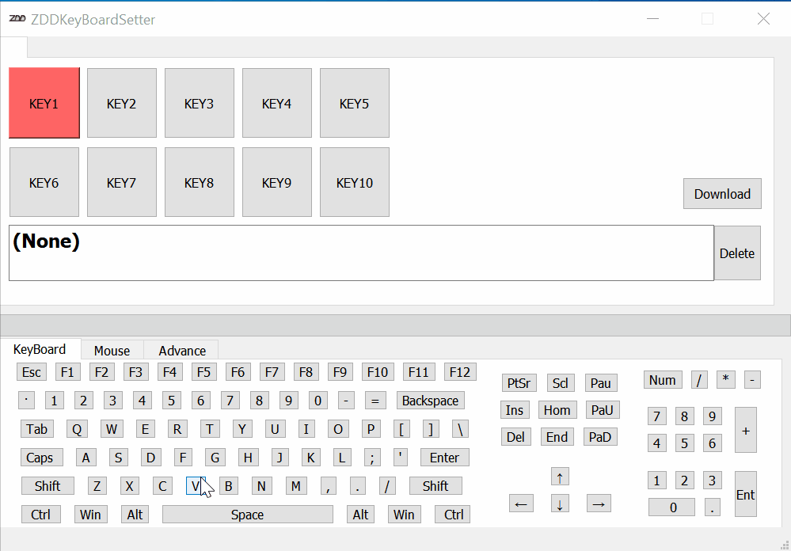

Result:

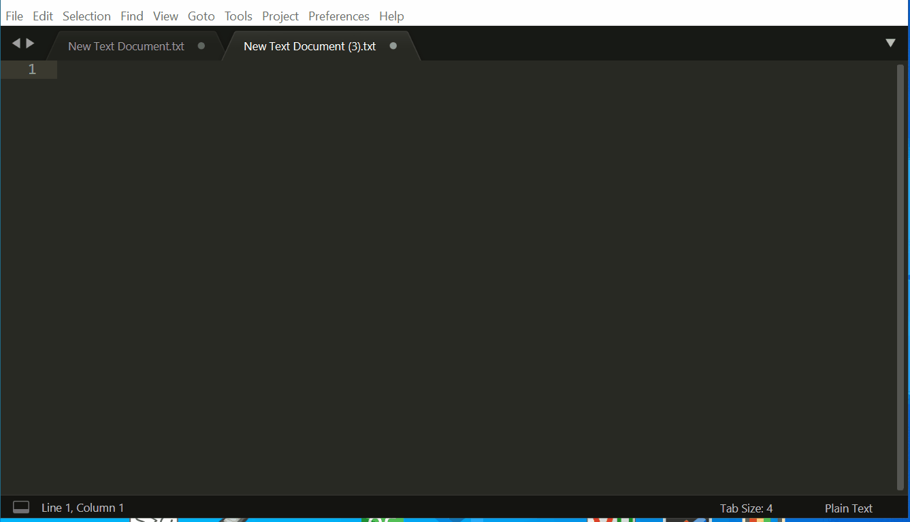

### Mouse & Multi-Media

Our production does **NOT** support using mouse or multi-media keys in any **Macro**.

Use tab window to switch pages and setup these keys

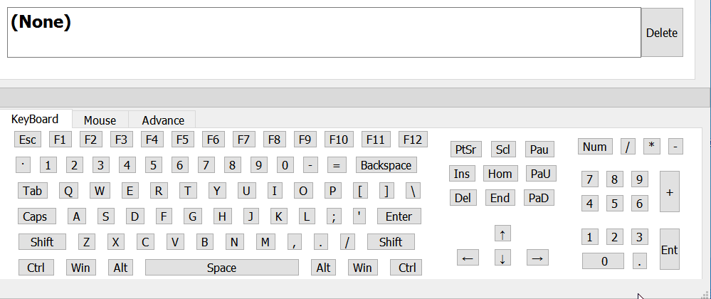

## Notice

### Non-Windows system usage:

The Keyboard should finish setting on windows pc **first** ,Then plug into other OS. If you are using MacOS, the "Win" key is equal to "command" and "alt" = "option".

### Software related:

ZDDKeyboradSetter.exe opened and the font is too large: Try to shrink your font size, right click on your desktop select "Display settings".

### Configure related:

1. If you have 2 or more keyboard, you can not set them at the same time, the software can only recognize one device.
2. The virtual keyboard inside this software is fully refer to the 128key keyboard. eg: if you want to set  '=' ,you should press . if you want to set '+', you should press 'Shift' first ,the press  .
3. If you set a key using some keypad keys, and these keys do not work, check whether you pressed 'Num Lock' key first.

### Macro related:

1. The total macro key length is 34 normal key (eg: 'a','b','1','Caps Lock'...) with maximum 10 function key (eg:'Ctrl','Win','Alt'...), 34 is the maximum sum number, not for one key, because this chip has only 128 Byte on-chip  memory.
2. Mouse key and Media key can not be added to the macro.
3. The delay function can not apply to a single key(eg: Delay2.5s+d),it is only worked in macro mode,and the delay function can only be a prefix.
4. You should press a key for enough time to trigger loop sending.
5. F13~F24 can be found in 'Advance' page, they act like normal keys (1,2,3,q,w,e,F1...).

## Errors

What if my keyboard doesn't working?

1. Try to plug your device into your USB port which at the back of your box.(ports on the motherboard)

2. Press a button but nothing happened (open ZDDKeyboardSetter.exe searching for device,but result in "can not found device"): Maybe your device is not connected to your PC, unplug your device and plug it into another port.

3. The device worked correctly, but ZDDKeyboardSetter.exe keep failing to find your device:

   * Change to another USB port will temporarily solve this problem.

   * Go to Windows device manager and reinstall the USB driver. (details below)

     1. Plug keyboard to the computer.

     2. Right click on "This Computer", go to This Computer > Manage (Windows11 : This Computer >Show more options > Manage).

     3. Find "Device Manager" and click it, then go to "Universal Serial Bus controllers" , and you will see many "USB Composite Device"s.

     4. Double click on one of them, a setting page will pop up,then click "Event" Tab.

     5. Find the device with VID_5131 PID_2019 and uninstall the driver.(Right click on corresponding "USB Composite Device").
     6. Re-plug in your device.

