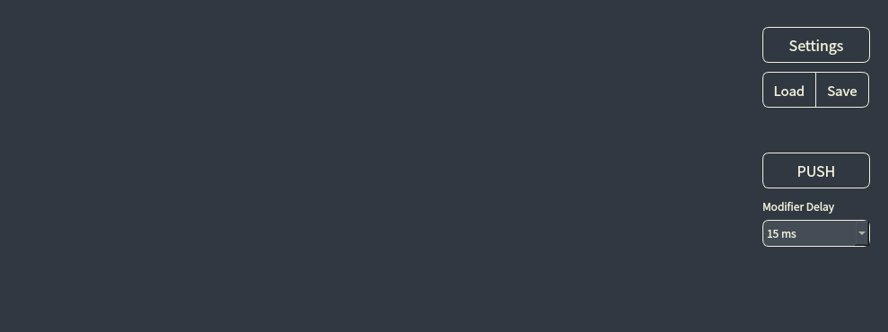

# CustomKeyboard

CustomKeyboard is a CH552-based programmable keyboard project with a Qt desktop configurator. The repository contains both the device firmware and the configuration utility used to assign keys, hotkeys, mouse buttons, media keys, and simple macros.

> Production note: firmware changes should be validated on a test device before being flashed to production hardware.

## Repository layout

```text
CustomKeyboard/                  CH552 firmware project
KeyBoardSetter/KeyboardSetter/   Qt desktop configuration app
Readme.assets/                   README images and UI captures
```

## Current status

- Firmware target: CH552 USB HID device.
- Desktop app: Qt-based keyboard setter.
- Configuration transport: HID reports sent from the desktop app to the device.
- Modifier delay support: configurable delay level for modifier-key sequences.
- Macro delays: stored in one-tenth-second units, including exact 0.7-second steps.
- Daily restart: firmware schedules a controlled reset after 24 hours of continuous powered uptime.
- Watchdog reset: general watchdog-reset mode remains disabled by default until hardware validation is complete.

## User interface

The keyboard setter lets users select a key, assign a normal key or modifier combination, configure macro steps, and download the configuration to the device. Open **Settings** to load or save configuration files, choose the interface language from a drop-down list, and set the global **Modifier Delay** level. The main window no longer has separate Load and Save controls. Pressing OK displays the restart notice only after the selected language actually changes and the preference is saved successfully.

The existing image below is retained as a legacy layout reference; current builds place **Modifier Delay** in Settings.



The **Modifier Delay** selector controls the delay inserted while sending modifier-key combinations. This can help hosts that need a slightly longer interval between Ctrl/Win/Alt/Shift state changes and the final key event.

Available levels:

| Level | Delay |
|---:|---:|
| 0 | Off (0 ms) |
| 1 | 5 ms |
| 2 | 10 ms |
| 3 | 20 ms |
| 4 | 30 ms |
| 5 | 50 ms |
| 6 | 100 ms |
| 7 | 150 ms |
| 8 | 200 ms |
| 9 | 300 ms |
| 10 | 500 ms |

The selected level is saved into the keyboard configuration file and sent to firmware using HID command `0x0e`.

## Features

### Single key and hotkey assignment

Select a physical key in the UI, then press keys on the virtual keyboard to assign the desired output. Modifier combinations such as `Ctrl + C`, `Win + R`, or `Shift + F4` are supported.

### Macros

A macro is a sequence of key events sent by one physical key. Macros can be used for repeated text, shortcuts, or short command sequences.

Supported macro data includes:

- Normal keyboard keys
- Modifier keys used with normal keys
- Delay steps stored as an integer number of tenths of a second

Macro **SetDelay** remains in the ADVANCE panel. Typed values and the plus/minus controls are normalized to one decimal place from `0.0` through `25.5` seconds. For example, `0.7` seconds is serialized, stored, and sent as integer byte `7`; firmware executes it as seven 100 ms waits, or 700 ms total.

Limitations:

- Mouse keys and media keys are not supported inside macros.
- Macro storage is limited by the CH552 on-chip memory layout.
- Existing firmware layout stores macro and key configuration in a compact 128-byte DataFlash area.

### Mouse, media, and Menu keys

Mouse and media functions are configured from the desktop app and are sent as dedicated HID usages. The compact mouse view labels its controls **L**, **M**, and **R**, with translated **Mouse Left**, **Mouse Middle**, and **Mouse Right** tooltips. They are configured separately from macro steps.

The standard Menu/Application key replaces the former right Win key between right Alt and right Ctrl at logical index `72`. It uses USB HID Keyboard/Keypad usage `0x65` and follows the normal-key path rather than the modifier-byte path. No duplicate Menu key is added to ADVANCE; saved configurations that used index `72` intentionally resolve to Menu, while all other logical indices remain stable.

## Firmware configuration layout

The firmware keeps the existing DataFlash layout for compatibility:

| Address range | Purpose |
|---:|---|
| `0..9` | Normal key codes |
| `10..19` | Modifier key codes |
| `20..21` | Macro key flags |
| `22..32` | Macro split indexes |
| `33..42` | Macro modifier key codes |
| `43..52` | Macro modifier indexes |
| `53..86` | Macro normal key codes |
| `87..96` | Mouse key codes |
| `97..106` | Media key codes |
| `107..116` | Macro delay values |
| `117..126` | Macro delay indexes |
| `127` | Modifier delay level |

The modifier delay level uses address `127` so the existing ranges and old command meanings remain unchanged.

## HID configuration commands

The desktop app sends configuration frames to the device. Existing command IDs remain unchanged:

| Command | Purpose |
|---:|---|
| `0x01` | Set normal key codes |
| `0x02` | Set modifier key codes |
| `0x03` | Set macro key flags |
| `0x04` | Set macro split indexes |
| `0x05` | Set macro modifier key codes |
| `0x06` | Set macro modifier indexes |
| `0x07` | Set macro normal key codes |
| `0x08` | Set mouse key codes |
| `0x09` | Set media key codes |
| `0x0a` | Set macro delay values |
| `0x0b` | Set macro delay indexes |
| `0x0c` | Hardware ACK test |
| `0x0d` | Simple read/test response |
| `0x0e` | Set modifier delay level |

Command `0x0e` is additive. Older firmware that does not support it can still receive the base configuration frames, but the desktop app will report that modifier-delay ACK failed and that firmware should be updated for this feature.

## Build notes

### Qt desktop app

The Qt project is located at:

```text
KeyBoardSetter/KeyboardSetter/KeyboardSetter.pro
```

A normal build uses qmake and make from a Qt 5 environment:

```bash
cd KeyBoardSetter/KeyboardSetter
mkdir -p build
cd build
qmake ../KeyboardSetter.pro
make -j$(nproc)
```

On Linux, the bundled HID source may require platform-specific hidapi handling. If the build selects the Windows hidapi backend, it may fail with `windows.h: No such file or directory`; use the correct hidapi backend or cross-build environment for the target platform.

### CH552 firmware

The firmware project is under:

```text
CustomKeyboard/usar/
```

Build it with the existing CH552/Keil-compatible firmware toolchain used by the project. Always validate on a spare test device before flashing production units.

The firmware uses Timer2 as a 10 ms uptime source and schedules a controlled software reset after 86,400 seconds (24 hours) of continuous powered operation. Unplugging or losing power naturally starts the uptime interval again. Timer2 timing, software-reset behavior, USB disconnect/re-enumeration, and DataFlash retention must be validated on a spare CH552 device before production deployment. A practical test should first use a shortened compile-time interval, then restore the production 86,400-second threshold for a long-duration test.

## Production safety and rollback

Before changing production firmware or the desktop tool:

1. Back up the full project directory.
2. Save the current git diff.
3. Build the desktop app.
4. Build firmware with the CH552 toolchain.
5. Test on a non-production keyboard.
6. Verify key assignment, macro download, modifier combinations, disconnect/reconnect persistence, and rollback.

For the current modifier-delay work, watchdog reset is intentionally disabled by default:

```c
#define ENABLE_WATCHDOG_RESET 0
```

Only enable it after USB enumeration, configuration download, long macro delay, and normal key operation have all been validated on real hardware.

## Basic usage

1. Plug in the keyboard.
2. Open the keyboard setter app.
3. Select the physical key to edit.
4. Choose a normal key, hotkey, mouse key, media key, Menu/Application key, or macro sequence.
5. Open **Settings** to load/save configurations, choose a language, or adjust **Modifier Delay** if the host misses modifier-key combinations.
6. Use ADVANCE → **SetDelay** for per-step macro delays such as `0.7` seconds.
7. Click **PUSH** to download the configuration to the device.
8. Unplug and reconnect the keyboard to confirm the configuration is persistent.

## Troubleshooting

### The app cannot find the device

- Try another USB port, preferably a motherboard port.
- Disconnect other identical keyboards while configuring.
- On Windows, remove and reinstall the USB composite device matching the keyboard VID/PID if enumeration is stuck.

### A modifier hotkey sometimes fails

- Increase **Modifier Delay** from `0 ms (Off)` to `5 ms`, `10 ms`, or a higher value.
- Download the configuration again.
- Reconnect the keyboard and retest the hotkey.

### Macro delay does not work as expected

- Delay steps are for macro mode, not normal single-key mode.
- Enter seconds with one decimal digit; `0.7` represents byte value `7` and 700 ms on firmware.
- Values are rounded to the nearest tenth and constrained to `0.0..25.5` seconds.
- Keep the macro within firmware storage limits.
- Mouse and media keys cannot be inserted into macros.

## Legacy screenshots

Older usage examples are still kept in `Readme.assets/` for reference, including setup and macro demonstration GIFs from the original project documentation.
